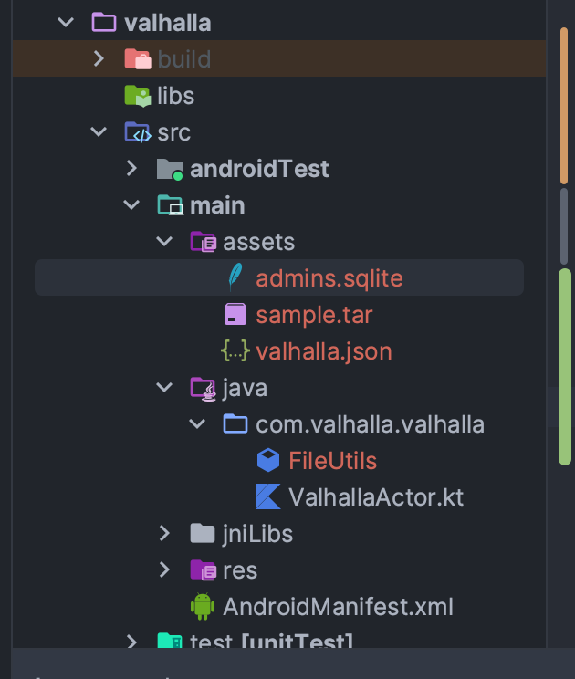

# Valhalla Mobile Build POC

## Setup

```sh
git submodule update --init --recursive

# Build 
./build_protoc_local.sh
./build_wrapper.sh

# Move the wrapper library to the right location for JNI
cp build/arm64-v8a/wrapper/wrapper/libvalhalla_wrapper.so valhalla/src/main/jniLibs/arm64-v8a
```

## Using the demo app

1. Copy your valhalla.json, tiles tar file and admins.sqlite to the `valhalla/src/main/assets` to use the defualt FileUtils behavior. See



2. Ensure the route request includes lat-longs within your tile's bounding box.
3. Tap make route.

### References
 
* https://github.com/valhalla/valhalla/issues/4131
* https://stackoverflow.com/questions/69730296/libvalhalla-cmake-link-static-library-android
* https://github.com/protocolbuffers/protobuf/issues/11671
